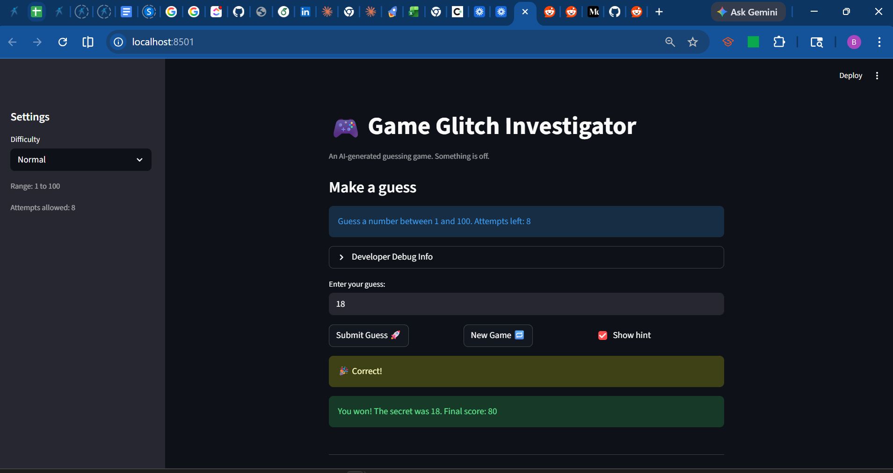

# 🎮 Game Glitch Investigator: The Impossible Guesser

## 🚨 The Situation

You asked an AI to build a simple "Number Guessing Game" using Streamlit.
It wrote the code, ran away, and now the game is unplayable.

- You can't win.
- The hints lie to you.
- The secret number seems to have commitment issues.

## 🛠️ Setup

1. Install dependencies: `pip install -r requirements.txt`
2. Run the broken app: `python -m streamlit run app.py`

## 🕵️‍♂️ Your Mission

1. **Play the game.** Open the "Developer Debug Info" tab in the app to see the secret number. Try to win.
2. **Find the State Bug.** Why does the secret number change every time you click "Submit"? Ask ChatGPT: _"How do I keep a variable from resetting in Streamlit when I click a button?"_
3. **Fix the Logic.** The hints ("Higher/Lower") are wrong. Fix them.
4. **Refactor & Test.** - Move the logic into `logic_utils.py`.
   - Run `pytest` in your terminal.
   - Keep fixing until all tests pass!

## 📝 Document Your Experience

**Game Purpose:**

This is a number guessing game where the player tries to guess a randomly generated secret number within a limited number of attempts. The game gives hints after each guess to tell you whether to guess higher or lower, and awards points based on how quickly you find the answer.

**Bugs Found:**

- The hints were backwards: guessing too high told you to go higher instead of lower
- The secret number type was being switched to a string on every even attempt, making correct
  guesses fail silently
- The Hard difficulty range (1–50) was actually easier than Normal (1–100)
- The info bar always showed "1 and 100" regardless of which difficulty was selected
- The attempts counter started at 1 instead of 0, giving one fewer attempt on the first game
- All four logic functions in logic_utils.py raised NotImplementedError and were never implemented

**Fixes Applied:**

- Moved all game logic (check_guess, parse_guess, get_range_for_difficulty, update_score)
  into logic_utils.py and imported them into app.py
- Fixed check_guess to return the correct hint direction ("Go LOWER!" when guess is too high)
- Removed the type-switching block that was converting the secret to a string on even attempts
- Fixed Hard difficulty range to 1–500 so it is actually harder than Normal
- Updated the info bar to use the dynamic {low} and {high} values from get_range_for_difficulty
- Fixed attempts initialization from 1 to 0

## 📸 Demo

## 🚀 Stretch Features

- [ ] [If you choose to complete Challenge 4, insert a screenshot of your Enhanced Game UI here]
